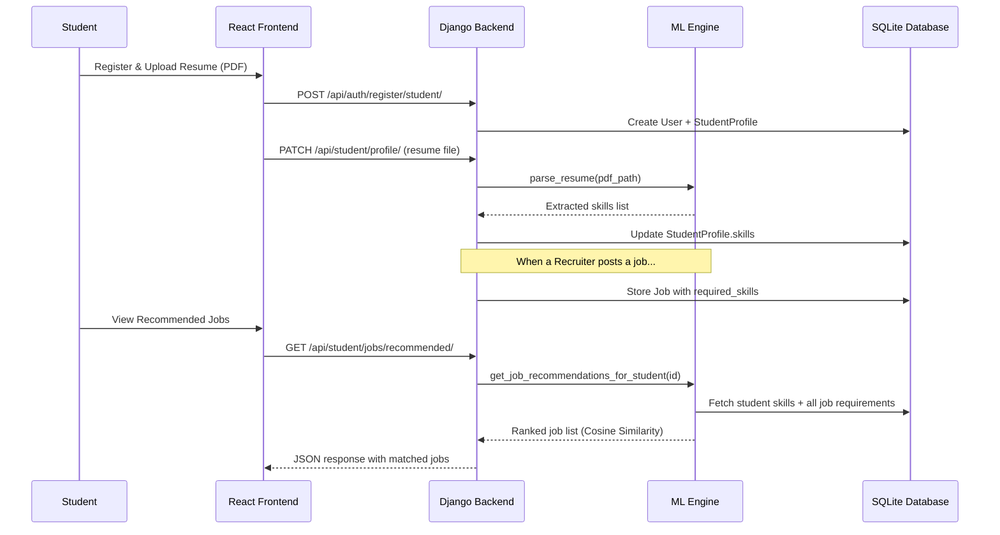

# Smart Campus Placement System

A full-stack web platform that automates and optimizes the campus recruitment process using **Django REST Framework**, **React.js**, and **Machine Learning (NLP + Cosine Similarity)**.

---

## Table of Contents

- [Features](#features)
- [System Architecture](#system-architecture)
- [Tech Stack](#tech-stack)
- [Project Structure](#project-structure)
- [Data Flow / Workflow](#data-flow--workflow)
- [Database Schema](#database-schema)
- [API Endpoints](#api-endpoints)
- [Getting Started](#getting-started)
- [Running the Project](#running-the-project)
- [Default Credentials](#default-credentials)

---

## Features

| Role | Capabilities |
|---|---|
| **Student** | Register, upload resume (auto-parsed via NLP), browse jobs, view AI-recommended jobs, apply for positions, track application status |
| **Recruiter** | Register company, post job openings, view applicants, see AI-recommended candidates, update application status (shortlist/select/reject) |
| **Admin** | View placement analytics dashboard (total students, companies, jobs, applications, placements) |

---

## System Architecture

```
┌─────────────────────────────────────────────────────────────────┐
│                     PRESENTATION LAYER                          │
│              React.js + Bootstrap (Vite Dev Server)             │
│     Student Dashboard │ Recruiter Dashboard │ Admin Dashboard   │
└──────────────────────────────┬──────────────────────────────────┘
                               │  HTTP / REST (JSON)
                               │  JWT Authentication
┌──────────────────────────────▼──────────────────────────────────┐
│                     APPLICATION LAYER                           │
│                  Django + Django REST Framework                  │
│                                                                 │
│  ┌─────────────┐  ┌──────────────┐  ┌────────────────────────┐  │
│  │  Auth APIs   │  │  CRUD APIs   │  │  ML Engine APIs        │  │
│  │  (JWT)       │  │  (Student,   │  │  (Resume Parser,       │  │
│  │              │  │   Recruiter, │  │   Recommendation       │  │
│  │              │  │   Admin)     │  │   Engine)               │  │
│  └─────────────┘  └──────────────┘  └────────────────────────┘  │
└──────────────────────────────┬──────────────────────────────────┘
                               │
          ┌────────────────────┼────────────────────┐
          ▼                    ▼                    ▼
┌──────────────┐   ┌──────────────────┐   ┌──────────────────┐
│   SQLite DB  │   │  SpaCy + NLTK    │   │  Scikit-Learn    │
│  (Data Layer)│   │  (NLP Resume     │   │  (TF-IDF +       │
│              │   │   Parsing)       │   │   Cosine Sim)    │
└──────────────┘   └──────────────────┘   └──────────────────┘
```

---

## Tech Stack

| Layer | Technology |
|---|---|
| Frontend | React.js 19, Vite, React Bootstrap, Axios, React Router v7 |
| Backend | Python 3, Django 6, Django REST Framework, SimpleJWT |
| Database | SQLite (development) |
| ML / NLP | SpaCy (`en_core_web_sm`), PyMuPDF (fitz), Scikit-Learn (TF-IDF, Cosine Similarity) |

---

## Project Structure

```
Campus Placement System/
├── backend/                     # Django Backend
│   ├── core/                    # Main app (models, views, serializers, urls)
│   │   ├── models.py            # User, StudentProfile, Company, Job, Application, Placement
│   │   ├── serializers.py       # DRF serializers for all models
│   │   ├── views.py             # API views for all roles
│   │   ├── urls.py              # API route definitions
│   │   └── admin.py             # Django admin registrations
│   ├── ml_engine/               # Machine Learning module
│   │   ├── resume_parser.py     # PDF text extraction + NLP skill extraction (SpaCy)
│   │   └── recommender.py       # TF-IDF + Cosine Similarity job/student matching
│   ├── smart_placement/         # Django project settings
│   │   ├── settings.py
│   │   └── urls.py
│   ├── manage.py
│   └── venv/                    # Python virtual environment
│
├── frontend/                    # React Frontend (Vite)
│   ├── src/
│   │   ├── api.js               # Axios instance with JWT interceptor
│   │   ├── context/
│   │   │   └── AuthContext.jsx   # Global authentication state
│   │   ├── components/
│   │   │   └── Navbar.jsx        # Role-aware navigation bar
│   │   ├── pages/
│   │   │   ├── Home.jsx
│   │   │   ├── Login.jsx
│   │   │   ├── Register.jsx      # Multi-role registration (Student/Recruiter)
│   │   │   ├── student/
│   │   │   │   ├── StudentDashboard.jsx
│   │   │   │   └── AvailableJobs.jsx
│   │   │   ├── recruiter/
│   │   │   │   ├── RecruiterDashboard.jsx
│   │   │   │   ├── PostJob.jsx
│   │   │   │   └── JobApplications.jsx
│   │   │   └── admin/
│   │   │       └── AdminDashboard.jsx
│   │   ├── App.jsx
│   │   └── main.jsx
│   └── package.json
└── README.md
```

---

## Data Flow / Workflow



---

## Database Schema

```
┌──────────────────┐     ┌──────────────────┐     ┌──────────────────┐
│      User        │     │  StudentProfile   │     │     Company      │
├──────────────────┤     ├──────────────────┤     ├──────────────────┤
│ id               │◄──┐ │ id               │     │ id               │
│ username         │   └─│ user (FK)        │  ┌──│ user (FK)        │
│ email            │     │ first_name       │  │  │ name             │
│ password         │     │ last_name        │  │  │ description      │
│ role             │◄──┐ │ degree           │  │  │ website          │
└──────────────────┘   │ │ major            │  │  │ location         │
                       │ │ gpa              │  │  └──────────────────┘
                       │ │ resume (file)    │  │          │
                       │ │ skills (text)    │  │          │
                       │ └──────────────────┘  │  ┌──────▼───────────┐
                       │         │             │  │      Job         │
                       │         │             │  ├──────────────────┤
                       │  ┌──────▼───────────┐ │  │ id               │
                       │  │  Application     │ └──│ company (FK)     │
                       │  ├──────────────────┤    │ title            │
                       │  │ id               │    │ description      │
                       │  │ student (FK)     │    │ required_skills  │
                       │  │ job (FK) ────────┼───►│ salary_package   │
                       │  │ status           │    │ location         │
                       │  │ applied_on       │    │ is_active        │
                       │  │ cover_letter     │    └──────────────────┘
                       │  └──────────────────┘
                       │
                       │  ┌──────────────────┐
                       │  │   Placement      │
                       │  ├──────────────────┤
                       └──│ student (FK)     │
                          │ job (FK)         │
                          │ package_offered  │
                          │ placed_on        │
                          └──────────────────┘
```

---

## API Endpoints

### Authentication
| Method | Endpoint | Description |
|---|---|---|
| POST | `/api/auth/register/student/` | Register a new student |
| POST | `/api/auth/register/recruiter/` | Register a new recruiter |
| POST | `/api/auth/login/` | Get JWT access + refresh tokens |
| POST | `/api/auth/refresh/` | Refresh JWT token |
| GET | `/api/auth/profile/` | Get current user info |

### Student
| Method | Endpoint | Description |
|---|---|---|
| GET/PATCH | `/api/student/profile/` | View/update profile & upload resume |
| GET | `/api/student/jobs/` | List all active jobs |
| GET | `/api/student/jobs/recommended/` | AI-recommended jobs for student |
| POST | `/api/student/jobs/apply/` | Apply to a job |
| GET | `/api/student/applications/` | View submitted applications |

### Recruiter
| Method | Endpoint | Description |
|---|---|---|
| GET/PATCH | `/api/recruiter/profile/` | View/update company profile |
| GET/POST | `/api/recruiter/jobs/` | List own jobs / post new job |
| GET/PUT/DELETE | `/api/recruiter/jobs/<id>/` | Manage a specific job |
| GET | `/api/recruiter/jobs/<id>/recommendations/` | AI-recommended students for a job |
| GET | `/api/recruiter/jobs/<id>/applications/` | View applications for a job |
| PATCH | `/api/recruiter/applications/<id>/status/` | Update application status |

### Admin
| Method | Endpoint | Description |
|---|---|---|
| GET | `/api/admin/dashboard/` | Placement analytics summary |

---

## Getting Started

### Prerequisites
- **Python 3.10+**
- **Node.js 18+** and npm
- Git

### 1. Clone the Repository
```bash
git clone <repository-url>
cd "Campus Placement System"
```

### 2. Backend Setup
```bash
cd backend

# Create and activate virtual environment
python -m venv venv

# Windows
.\venv\Scripts\activate

# macOS/Linux
source venv/bin/activate

# Install dependencies
pip install django djangorestframework djangorestframework-simplejwt django-cors-headers scikit-learn pandas numpy spacy nltk pymupdf

# Download SpaCy English model
python -m spacy download en_core_web_sm

# Run database migrations
python manage.py makemigrations core
python manage.py migrate

# (Optional) Create a superuser for Django Admin access
python manage.py createsuperuser
```

### 3. Frontend Setup
```bash
cd frontend

# Install dependencies
npm install
```

---

## Running the Project

Open **two separate terminals**:

### Terminal 1 — Backend (Django)
```bash
cd backend
.\venv\Scripts\activate          # Windows
python manage.py runserver
```
Backend runs at: **http://localhost:8000**

### Terminal 2 — Frontend (React)
```bash
cd frontend
npm run dev
```
Frontend runs at: **http://localhost:5173**

---

## Default Credentials

After running `python manage.py createsuperuser`, use those credentials to access:
- **Django Admin Panel**: http://localhost:8000/admin/
- **Admin Dashboard** (frontend): Log in at http://localhost:5173/login and navigate to the Admin Dashboard.

> **Note**: The Admin Dashboard API requires `is_staff=True` on the user. Set this via Django Admin or the `createsuperuser` command.

---

## ML Engine Details

| Component | Technology | Purpose |
|---|---|---|
| Resume Parser | SpaCy + PyMuPDF | Extracts text from PDF resumes, identifies skills via NLP pattern matching |
| Recommendation Engine | Scikit-Learn TF-IDF + Cosine Similarity | Matches student skill profiles against job requirements, ranks by relevance score |

Skills are automatically extracted when a student uploads a resume via the Student Dashboard.

---

## License

This project was developed for academic purposes as part of a campus placement automation initiative.
